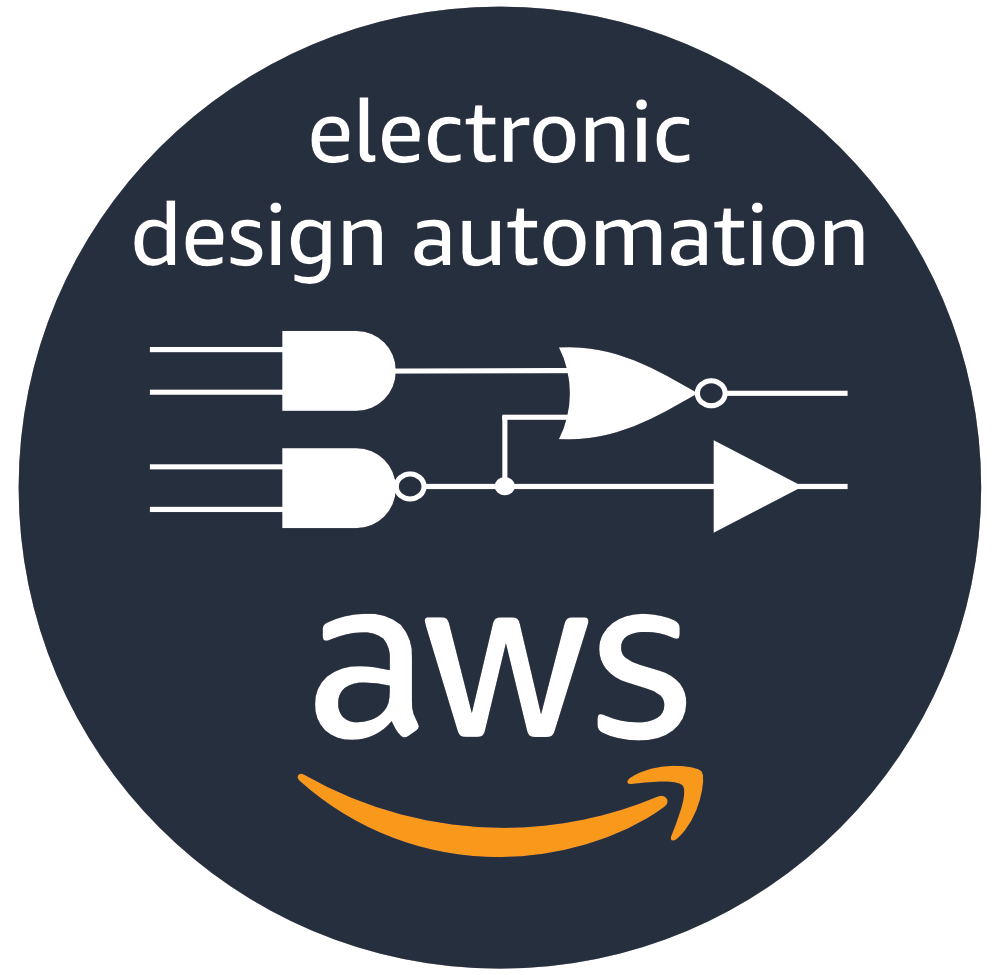

# AWS EDA Workshops

Samples and documentation for deploying EDA computing environments in AWS

## Overview

These hands-on workshops are designed to demonstrate how the elasticity of the AWS Cloud can help you accelerate EDA design cycles and reduce time-to-market.

## Workshops

- [**EDA Workshop with IBM Spectrum LSF**](workshops/eda-workshop-lsf)  
This workshop shows you how to deploy a fully functional compute cluster based on IBM Spectrum LSF.  The environment includes all resources required to run an EDA verification workload on a sample design. Using standard LSF commands, you can quickly add compute capacity to satisfy verification workload demand.

- **EDA Workshop with AWS ParallelCluster**
This workshop shows you how to deploy an EDA computing cluster using AWS ParallelCluster. AWS ParallelCluster is an AWS supported Open Source cluster management tool that makes it easy for you to deploy and manage High Performance Computing (HPC) clusters in the AWS cloud.

## License Summary

This sample code is made available under the MIT-0 license. See the LICENSE file.
