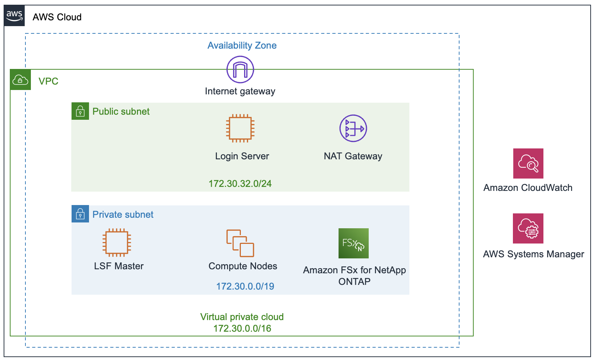

# Deploy an LSF-based EDA Computing Environment

## Overview

This tutorial shows you how to deploy an elastic EDA computing cluster on AWS based on the IBM Spectrum LSF workload and resource management software and run an EDA logic verification workload within the environment. The deployed environment installs and configures the LSF software that you provide, using your licenses, and supplies the necessary EDA software and example design data to run an example EDA verification workload on the AWS Cloud. Using standard LSF commands, you will be able to submit front-end verification workload into the queue and observe as LSF dynamically adds and removes compute resources as the jobs flow through the system.

This tutorial is for IT, CAD, and design engineers who are interested in running EDA workloads in the cloud using IBM's Spectrum LSF.

### IBM Spectrum LSF on AWS

The Resource Connector feature in IBM Spectrum LSF 10.1 Standard and Advanced Editions enables LSF clusters to dynamically provision and deprovision right-sized AWS compute resources to satisfy pending demand in the queues. These dynamic hosts join the cluster, accept jobs, and are terminated when all demand has been satisfied.  This process happens automatically based on the Resource Connector configuration.

For more information about IBM Spectrum LSF Resource Connector, please see the [official documentation](https://www.ibm.com/support/knowledgecenter/en/SSWRJV_10.1.0/lsf_welcome/lsf_kc_resource_connector.html) on the IBM website.

### Cost and Licenses

You are responsible for the cost of the AWS services used while running this reference deployment. There is no additional cost for using this tutorial.

The AWS CloudFormation template for this tutorial includes configuration parameters that you can customize. Some of these settings, such as instance type, will affect the cost of deployment. For cost estimates, see the pricing pages for each AWS service you will be using. Prices are subject to change.

IBM Spectrum LSF software and licenses are not provided by this tutorial. You must provide the licenses and full distribution packages for the software. We recommend that you verify with your IBM sales team that your LSF license terms allow you to run the software on the AWS Cloud.

## Workshop Architecture

Deploying this cluster in a new virtual private cloud (VPC) with default parameters builds the following EDA computing environment in the AWS Cloud.

The tutorial sets up the following:

- A VPC configured with public and private subnets to provide you with your own virtual network on AWS.*
- In the public subnet, a managed NAT gateway to allow outbound internet access for resources in the private subnets.
- In the public subnet, a Linux login/submission host to allow inbound Secure Shell (SSH) access to the environment.
- In the private subnet, an LSF master running IBM Spectrum LSF with the Resource Connector feature enabled, Amazon EC2 compute instances that are dynamically provisioned by LSF, and a Linux-based NFS server for runtime scratch data.
- An Amazon Elastic File System (EFS) file system for the LSF distribution and configuration files.

> NOTE: This tutorial also provides an option to launch the cluster in an existing VPC.  The architecture will be similar to the diagram above, but it will not include a Linux-based NFS server and will instead rely on EFS as the sole shared NFS file system.

## Planning the Deployment

### Specialized Knowledge

This tutorial assumes familiarity with networking, the Linux command line, and EDA workflows. Additionally, intermediate-level experience with NFS storage and LSF operations will be helpful.

This deployment guide also requires a moderate level of familiarity with AWS services. If you’re new to AWS, visit the [Getting Started Resource Center](https://aws.amazon.com/getting-started/) and the [AWS Training and Certification website](https://aws.amazon.com/training/) for materials and programs that can help you develop the skills to design, deploy, and operate your infrastructure and applications on the AWS Cloud.

### IBM LSF Software

The IBM Spectrum LSF software is not provided in this workshop; you will need to download LSF and an associated entitlement file from your IBM Passport Advantage portal to complete this tutorial.  Download the following packages from the web portal:

- `lsf10.1_lsfinstall_linux_x86_64.tar.Z`
- `lsf10.1_linux2.6-glibc2.3-x86_64.tar.Z` This should the latest full distribution package and not a patch or Fix Pack.
- `lsf_std_entitlement.dat` or `lsf_adv_entitlement.dat`

### AWS Account

If you don’t already have an AWS account, create one at [aws.amazon.com](https://aws.amazon.com) by following the on-screen instructions. Part of the sign-up process involves receiving a phone call and entering a PIN using the phone keypad. Your AWS account is automatically signed up for all AWS services. You are charged only for the services you use.

Before you launch this tutorial, your account must be configured as specified below. Otherwise, the deployment might fail.

#### Resources

If necessary, request [service limit increases](https://console.aws.amazon.com/support/home#/case/create?issueType=service-limit-increase&limitType=service-code-) for the following resources. You might need to do this if you already have an existing deployment that uses these resources, and you think you might exceed the default limits with this deployment. For default limits, see the [AWS documentation](http://docs.aws.amazon.com/general/latest/gr/aws_service_limits.html).
[AWS Trusted Advisor](https://console.aws.amazon.com/trustedadvisor/home?#/category/service-limits) offers a service limits check that displays your usage and limits for some aspects of some services.

|Resource|This deployment uses|
|:---|:---:|
|VPCs|1|
|Internet gateway|1|
|NAT gateway|1|
|IAM security groups|4|
|IAM roles|4|
|EFS file systems|1|
|i3.16xlarge instance|1|
|m5.2xlarge instance|1|
|t3.medium instance|1|
|c5.2xlarge instance|Up to 20|

#### Regions

This deployment includes Amazon Elastic File System (EFS), which isn’t currently supported in all AWS Regions. For a current list of supported regions, see [AWS Regions and Endpoints](https://docs.aws.amazon.com/general/latest/gr/rande.html#elasticfilesystem-region) in the AWS documentation.

#### Key pair

Make sure that at least one Amazon EC2 key pair exists in your AWS account in the region where you are planning to deploy the tutorial. Make note of the key pair name. You’ll be prompted for this information during deployment. To create a key pair, follow the [instructions in the AWS documentation](https://docs.aws.amazon.com/AWSEC2/latest/UserGuide/ec2-key-pairs.html).
If you’re deploying the tutorial for testing or proof-of-concept purposes, we recommend that you create a new key pair instead of specifying a key pair that’s already being used by a production instance.

#### IAM permissions

To deploy the environment, you must log in to the AWS Management Console with IAM permissions for the resources and actions the templates will deploy. You'll need to log in with an IAM User that has the **AdministratorAccess** managed policy within IAM.  This managed policy provides sufficient permissions to deploy this workshop although your organization may choose to use a custom policy with more restrictions.

## Deployment Options

This tutorial provides two deployment options:

- **Deploy the cluster into a new VPC**. This option builds a new AWS environment consisting of the VPC, subnets, NAT gateways, security groups, an NFS server, an LSF master, and other infrastructure components, and then deploys LSF into this new VPC.

- **Deploy the cluster into an existing VPC**. This option provisions the cluster in an existing VPC.  Instead of a Linux-based NFS server, this environment relies on EFS for the NFS file system.

This tutorial provides separate CloudFormation templates for these options. It also lets you configure CIDR blocks, instance types, and other settings, as discussed later in this guide.

## Deployment Steps

### Step 1. Sign in to your AWS account

1. Sign in to your AWS account at <https://aws.amazon.com> with an IAM user role that includes full administrative permissions. For details, see [Planning the deployment](#planning-the-deployment) earlier in this guide.

2. Make sure that your AWS account is configured correctly, as discussed in the [AWS Account](#aws-account) section.

### Step 2. Upload LSF Software Packages and Entitlement File

1. Upload the two required LSF software packages and the LSF entitlement file to an S3 bucket in your account.

### Step 3. Subscribe to the Required AMIs

This workshop requires a subscription to the following AMIs in AWS Marketplace. AMIs are images that are used to boot the instances (virtual servers) in AWS. They also contain software required to run the workshop.  There is no additional cost to use these AMIs.

- AWS FPGA Developer AMI
- Official CentOS 7 x86_64 HVM AMI

Sign in to your AWS account, and follow these instructions to subscribe:

1. Open the page for the [AWS FPGA Developer AMI](https://aws.amazon.com/marketplace/pp/B06VVYBLZZ) AMI in AWS Marketplace, and then choose **Continue to Subscribe**.

1. Review the terms and conditions for software usage, and then choose **Accept Terms**. You will get a confirmation page, and an email confirmation will be sent to the account owner. For detailed subscription instructions, see the [AWS Marketplace documentation](https://aws.amazon.com/marketplace/help/200799470).

1. When the subscription process is complete, exit out of AWS Marketplace without further action. **Do not** click **Continue to Launch**; the workshop CloudFormation templates will deploy the AMI for you.

1. Repeat the steps 1 through 3 to subscribe to the [Official CentOS 7 x86_64 HVM AMI](https://aws.amazon.com/marketplace/pp/B00O7WM7QW) AMI.

1. Verify the subscriptions in the [Marketplace dashboard](https://console.aws.amazon.com/marketplace/home) within the AWS Console.
    - Click on **Manage subscriptions** to confirm that the two AMI subscriptions are active in your account.

### Step 4. Launch the Cluster

**Note** The instructions in this section reflect the new version of the AWS CloudFormation console. If you’re using the original console, some of the user interface elements might be different.   You can switch to the new console by selecting **New console** from the **CloudFormation** menu.

1. Sign in to your AWS account at https://aws.amazon.com with an IAM user role that includes full administrative permissions.

1. Click one of the deployment options below to start the CloudFormation deployment process. The link will take you to the AWS CloudFormation console with the path to the deployment template preloaded.

    | Deploy into New VPC  | Deploy into Existing VPC |
    | :---: | :---: |
    | ||

    Check the region that's displayed in the upper-right corner of the navigation bar, and change it if necessary. This is where the cluster infrastructure will be built. The template is launched in the **US East (N. Virginia)** Region by default.

    **Note**  This deployment includes Amazon EFS, which is not currently supported in all AWS Regions. For a current list of supported regions, see the [AWS Regions and Endpoints webpage](https://docs.aws.amazon.com/general/latest/gr/rande.html).

    **Important** If you're deploying the cluster into an existing VPC, make sure that your VPC has two private subnets, and that the subnets aren't shared. This tutorial doesn't support [shared subnets](https://docs.aws.amazon.com/vpc/latest/userguide/vpc-sharing.html). The Cloudformation template will create a [NAT gateway](https://docs.aws.amazon.com/vpc/latest/userguide/vpc-nat-gateway.html) in their route tables to allow the instances to download packages and software without exposing them to the internet. You will also need **DNS hostnames** and **DNS resolution** configured in the VPC's DHCP options as explained in the [Amazon VPC documentation](http://docs.aws.amazon.com/AmazonVPC/latest/UserGuide/VPC_DHCP_Options.html). 

1. In the **Select Template** section of the **Create stack**, keep the default setting for the template URL, and then choose **Next**.

1. On the **Specify stack details** page, change the stack name if desired. Review the parameters for the template. Provide values for the following parameters in the table below. For all other parameters, it is recommended that you keep the default settings, but you can customize them as necessary.

    |Parameter|Notes|
    |---|---|
    |SSH source CIDR|Enter the internet-facing IP from which you will log into the login server|
    |EC2 KeyPair|Select the key pair you created in your account|
    |Cluster name|Enter a name for the LSF cluster|
    |LSF install package|Enter the S3 protocol URL for the `lsf10.1_lsfinstall_linux_x86_64.tar.Z` package|
    |LSF binary package|Enter the S3 protocol URL for the `lsf10.1_linux2.6-glibc2.3-x86_64.tar.Z` package|
    |LSF entitlement file|Enter the S3 protocol URL for the LSF entitlement file.  This should be either `lsf_std_entitlement.dat` or `lsf_adv_entitlement.dat`.

    When you finish reviewing and customizing the parameters, choose **Next**.

1. On the **Configure stack options** page, you can specify [tags](https://docs.aws.amazon.com/AWSCloudFormation/latest/UserGuide/aws-properties-resource-tags.html) (key-value pairs) for resources in your stack.  We recommend setting **key** to `env` and **value** to `aws-lsf-eda-workshop` or something similar.  This will help to identify resources created by this tutorial. When you're done, choose **Next**.

1. On the **Review** page, review and confirm the template settings. Under **Capabilities** at the very bottom, select the two check boxes to acknowledge that the template will create IAM resources and that it might require the capability to auto-expand macros.

1. Choose **Create stack** to deploy the stack. Either deployment option takes about 30 minutes to complete.

1. Monitor the status of the stack. When the status is **CREATE\_COMPLETE**, the cluster is ready.

1. Use the URLs displayed in the **Outputs** tab for the stack to view the resources that were created.

### Step 5. Test the Deployment

1. Log into the login server via SSH as `centos` user using the private key from the key pair you provided in the Cloudformation stack and the IP address found in **LoginServerPublicIp** under the stack's **Outputs** tab.

   `ssh -i /path/to/private_key centos@<host_ip>`

1. Run the `lsid` command to verify that LSF installed properly and is running.

### Step 6. Run workload

Move on to the [next tutorial](run-workload.md) to run logic simulations in your new elastic LSF cluster in the AWS cloud.
