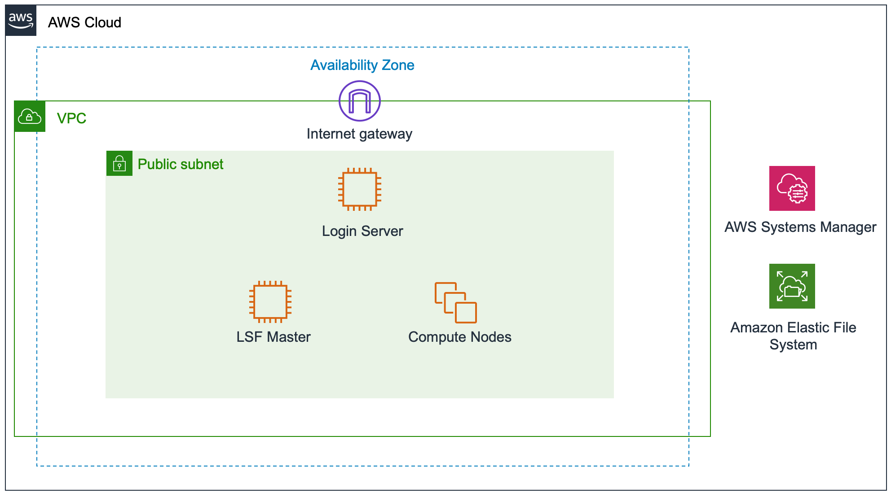
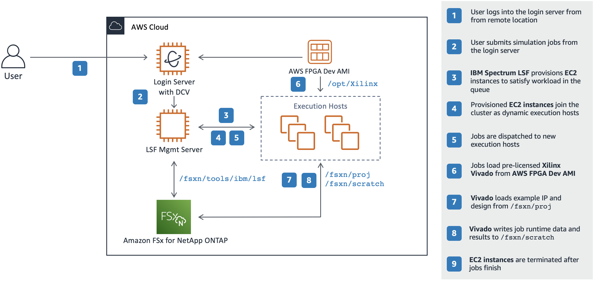

# Deploy an LSF-based EDA Computing Environment

## Contents

* [Workshop Overview](#overview)

* [Prerequisites](#prerequisites)

* [Deploy the environment](#deploy-the-environment)

* [Run example workload](#run-workload)

## Overview

This tutorial shows you how to deploy an elastic EDA computing cluster on AWS based on the IBM Spectrum LSF workload and resource management software and run an EDA logic verification workload within the environment. The deployed environment installs and configures the LSF software that you provide, using your licenses, and supplies the necessary EDA software and design data to run an example EDA verification workload on the AWS Cloud. Using standard LSF commands, you will be able to submit front-end verification workload into the queue and observe as LSF dynamically adds and removes compute resources as the jobs flow through the system.

This tutorial is for IT, CAD, and design engineers who are interested in running EDA workloads in the cloud using IBM's Spectrum LSF.

### Workshop Architecture

This environment deploys into an existing virtual private cloud (VPC) and builds the following EDA computing environment in the AWS Cloud.



The deployed cloud infrastructure consists of:

* A Linux login/submission host to allow inbound Secure Shell (SSH) and graphical remote desktop access to the environment.

* An LSF master running IBM Spectrum LSF with the Resource Connector feature enabled

* Amazon EC2 compute instances that are dynamically provisioned by LSF

* An Amazon Elastic File System (EFS) file system for the LSF distribution and configuration files, project, and scratch data.

### Workshop  Workflow



### Cost and Licenses

If you run this tutorial in your own account, you are responsible for the cost of the AWS services used while running this reference deployment. There is no additional cost for using this tutorial.

IBM Spectrum LSF software and licenses are not provided by this tutorial. You must provide the licenses and full distribution packages for the software.

## Prerequisites

1. Download the IBM Spectrum LSF software and associated entitlement file.

    The IBM Spectrum LSF software is not provided in this workshop; you will need to download LSF 10.1 Fix Pack 8 or newer and an associated entitlement file from your IBM Passport Advantage portal to complete this tutorial.  Download the following packages from the web portal:

   * `lsf10.1_lsfinstall_linux_x86_64.tar.Z`
   * `lsf10.1_linux2.6-glibc2.3-x86_64.tar.Z`
   * `lsf_std_entitlement.dat` or `lsf_adv_entitlement.dat`
   * `lsf10.1_linux2.6-glibc2.3-x86_64-xxxxxx.tar.Z` (latest Fix Pack)

1. Download and install the [NICE DCV remote desktop native client](https://download.nice-dcv.com) on the computer you will be using for this workshop.

1. Create SSH key pair by following the [Amazon EC2 Key Pairs documentation](https://docs.aws.amazon.com/AWSEC2/latest/UserGuide/ec2-key-pairs.html#having-ec2-create-your-key-pair).

## Deploy the environment

### Step 1. Sign in to your AWS account

1. Sign into the AWS account provided to you for this workshop.

### Step 2. Upload LSF Software Packages and Entitlement File

1. Create a new S3 bucket in the workshop account.
1. Upload the two required LSF software packages and the LSF entitlement file into the new S3 bucket.

### Step 3. Subscribe to the Required AMIs

This workshop requires a subscription to the following Amazon Machine Images (AMIs) in AWS Marketplace. AMIs are images that are used to boot the instances (virtual servers) in AWS. They also contain software required to run the workshop.  There is no additional cost to use these AMIs.

* **AWS FPGA Developer AMI**. This AMI provides the pre-licensed Xilinx Vivado EDA tool suite running on CentOS 7.7.
* **CentOS 7 (x86_64) - with Updates HVM AMI**. This is the official CentOS 7 image.

Be sure you are logged into the workshop AWS account, and follow these instructions to subscribe:

1. Open the page for the [AWS FPGA Developer AMI](https://aws.amazon.com/marketplace/pp/B06VVYBLZZ) AMI in AWS Marketplace, and then choose **Continue to Subscribe**.

1. Review the terms and conditions for software usage, and then choose **Accept Terms**. You will get a confirmation page, and an email confirmation will be sent to the account owner. For detailed subscription instructions, see the [AWS Marketplace documentation](https://aws.amazon.com/marketplace/help/200799470).

1. When the subscription process is complete, exit out of AWS Marketplace without further action. **Do not** click **Continue to Launch**; the workshop CloudFormation templates will deploy the AMI for you.

1. Repeat the steps 1 through 3 to subscribe to the [CentOS 7 (x86_64) - with Updates HVM](https://aws.amazon.com/marketplace/pp/B00O7WM7QW) AMI.

1. Verify the subscriptions in the [Marketplace dashboard](https://console.aws.amazon.com/marketplace/home) within the AWS Console.
    * Click on **Manage subscriptions** to confirm that the two AMI subscriptions are active in your account.

### Step 4. Launch the Cluster

**Note** The instructions in this section reflect the new version of the AWS CloudFormation console. If you’re using the original console, some of the user interface elements might be different.   You can switch to the new console by selecting **New console** from the **CloudFormation** menu.

1. Click The **Deploy to AWS** button below to start the CloudFormation deployment process. The link will take you to the AWS CloudFormation console with the path to the deployment template preloaded.

    [](https://console.aws.amazon.com/cloudformation/home?region=us-east-1#/stacks/new?stackName=aws-eda-lsf-workshop&templateURL=https://aws-eda-workshop-files.s3.amazonaws.com/workshops/eda-workshop-lsf/templates/eda-lsf-simple-workshop.yaml)

    The cluster infrastructure is deployed in the **US East (N. Virginia)** AWS Region by default.

1. In the **Specify template** section of the **Create stack** page, keep the default setting for the template URL, and then choose **Next**.

1. On the **Specify stack details** page, provide values for the following parameters in the table below. For all other parameters, it is recommended that you keep the default settings.

    |Parameter|Notes|
    |---|---|
    |Cluster VPC|Select the Virtual Private Cloud network where the infrastructure will be provisioned.  You should see only one option in the pop-up menu.
    |LSF master subnet|Select the subnet where the LSF master instance will be launched.
    |Compute node subnet|Select the subnet where LSF will provision its execution hosts. It is recommended to choose the same subnet you selected for the LSF master.
    |Source IP|Enter the internet-facing IP from which you will log into servers in the cloud cluster. You can use http://checkip.amazonaws.com or a similar service to discover you internet-facing IP address.|
    |EC2 Key Pair|Select the key pair you created earlier in this tutorial.  You should see only one option here.|
    |LSF install package|Enter the S3 protocol URL for your `lsf10.1_lsfinstall_linux_x86_64.tar.Z` package.  Select the package object in the S3 console and choose Copy Path and paste here. |
    |LSF binary package|Enter the S3 protocol URL for your `lsf10.1_linux2.6-glibc2.3-x86_64.tar.Z` package.  Select the package object in the S3 console and choose Copy Path and paste here.|
    |LSF entitlement file|Enter the S3 protocol URL for your LSF entitlement file.  This should be either `lsf_std_entitlement.dat` or `lsf_adv_entitlement.dat`.  Select the package object in the S3 console and choose Copy Path and paste here.
    |LSF Fix Pack| Enter the S3 protocol URL for the LSF Fix Pack package.  Select the package object in the S3 console and choose Copy Path and paste here.|
    |DCV login password|Enter a password for the DCV user. Note the password complexity requirements in the parameter description.

    When you finish reviewing and customizing the parameters, choose **Next**.

1. On the **Configure stack options** page, you can specify [tags](https://docs.aws.amazon.com/AWSCloudFormation/latest/UserGuide/aws-properties-resource-tags.html) (key-value pairs) for resources in your stack.  We recommend setting **key** to `env` and **value** to `aws-lsf-eda-workshop` or something similar.  This will help to identify resources created by this tutorial. When you're done, click **Add tag**.

1. Under **Stack creation options**, disable **Rollback on failure**. This will leave the resources up for debug in case an error occurs during the provisioning process. Choose **Next**.

1. On the **Review** page, review and confirm the stack details. Click the **Previous** button at the bottom of the page if you need to return to previous pages to make changes.  Under **Capabilities** at the very bottom, select the check box to acknowledge that the template will create IAM resources.

1. Choose **Create stack** to deploy the stack. Stack creation will take approximately 30 minutes to complete.

1. Monitor the status of the stack. When the status is **CREATE\_COMPLETE**, the cluster is ready.

1. Use the URLs displayed in the **Outputs** tab for the stack to view the resources that were created.

### Step 5. Log into the cluster

1. Log into the login/remote desktop server with the DCV client.

    1. In the CloudFormation console, click on the **aws-eda-lsf-workshop** stack and choose the **Outputs** tab.
    1. Copy the IP:port in the **Value** column for the **LoginServerRemoteDesktop**.  This is the public IP of the login server that was deployed by the CloudFormation stack.
    1. Launch the DCV client and paste the IP into the server field. Click **Connect** and then **Proceed**.  
    1. Enter the DCV username and password you provided in **Step 3** above in the credentials fields.
    1. Next, you should see a clock with a blue screen.  Click on it, enter your DCV password once again, and click the **Unlock** button.
    1. Close the **Getting Started** window to reveal the GNOME desktop.

1. Open a new terminal and run the `lsid` command to verify that LSF installed properly and is running.  You should see output similar to the following:

    ```text
    $ lsid
    IBM Spectrum LSF Standard 10.1.0.0, Jul 08 2016
    Copyright International Business Machines Corp. 1992, 2016.
    US Government Users Restricted Rights - Use, duplication or disclosure restricted by GSA ADP Schedule Contract with IBM Corp.

    My cluster name is mycluster
    My master name is ip-172-31-15-186
    ```

## Run workload

Move on to the [next tutorial](run-simple.md) to run logic simulations in your new elastic LSF cluster in the AWS cloud.
