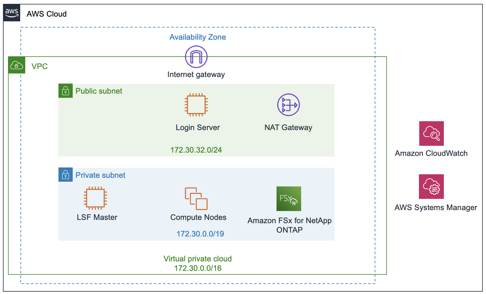

# Deploy an LSF-based EDA Computing Environment

## Overview

This tutorial shows you how to deploy an elastic EDA computing cluster on AWS based on the IBM Spectrum LSF workload and resource management software and run an EDA logic verification workload within the environment. The deployed environment installs and configures the LSF software that you provide, using your licenses, and supplies the necessary EDA software and example design data to run an example EDA verification workload on the AWS Cloud. Using standard LSF commands, you will be able to submit front-end verification workload into the queue and observe as LSF dynamically adds and removes compute resources as the jobs flow through the system.

This tutorial is for IT, CAD, and design engineers who are interested in running EDA workloads in the cloud using IBM's Spectrum LSF.

### IBM Spectrum LSF on AWS

The Resource Connector feature in IBM Spectrum LSF 10.1 Standard and Advanced Editions enables LSF clusters to dynamically provision and deprovision right-sized AWS compute resources to satisfy pending demand in the queues. These dynamic hosts join the cluster, accept jobs, and are terminated when all demand has been satisfied.  This process happens automatically based on the Resource Connector configuration.

### Cost and Licenses

If you run this tutorial in your own account, you are responsible for the cost of the AWS services used while running this reference deployment. There is no additional cost for using this tutorial.

IBM Spectrum LSF software and licenses are not provided by this tutorial. You must provide the licenses and full distribution packages for the software. 

## Workshop Architecture

This environment deploys into an existing virtual private cloud (VPC) and builds the following EDA computing environment in the AWS Cloud.

The tutorial sets up the following:

- A Linux login/submission host to allow inbound Secure Shell (SSH) or graphical remote desktop access to the environment.
- An LSF master running IBM Spectrum LSF with the Resource Connector feature enabled
- Amazon EC2 compute instances that are dynamically provisioned by LSF
- An Amazon Elastic File System (EFS) file system for the LSF distribution and configuration files, project, and scratch data.

## Let's do it

### IBM LSF Software

The IBM Spectrum LSF software is not provided in this workshop; you will need to download LSF 10.1 Fix Pack 8 or newer and an associated entitlement file from your IBM Passport Advantage portal to complete this tutorial.  Download the following packages from the web portal:

- `lsf10.1_lsfinstall_linux_x86_64.tar.Z`
- `lsf10.1_linux2.6-glibc2.3-x86_64.tar.Z` This should the latest full distribution package and not a patch or Fix Pack.
- `lsf_std_entitlement.dat` or `lsf_adv_entitlement.dat`
